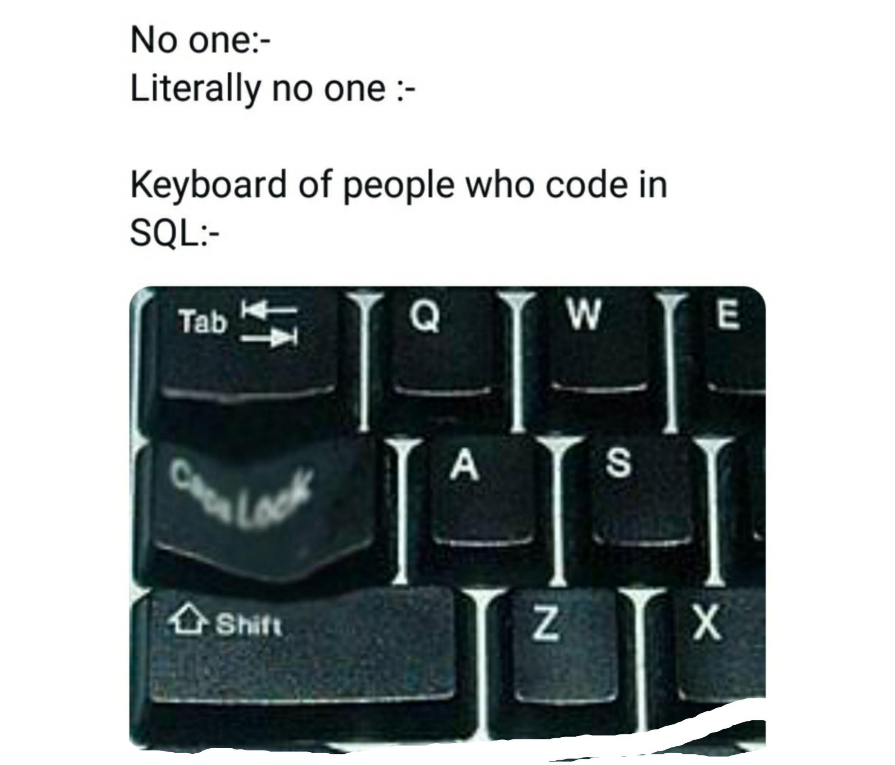

# Database basics course
This repository contains solutions to exercises for Data Base course at the University of Science and Tehnology.
At the end of the course I made the project - [Restaurant Management System](https://github.com/MaOlszewska/DataBasesProject-2021)

